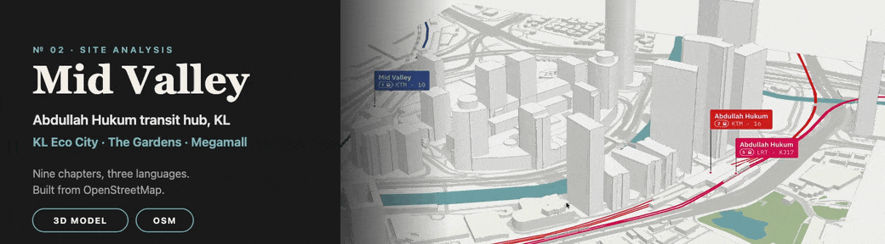
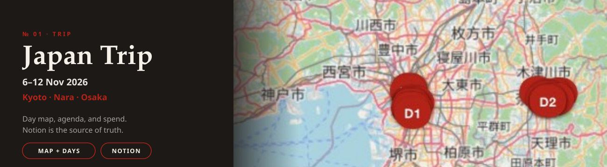
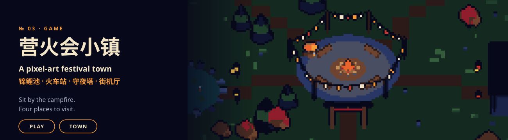

## Hello everyone! 👋

    My name is Alex and I'm a Full Stack Developer!

<b>把吉隆坡 Mid Valley 的轨道与商场枢纽做成可滚动浏览的 3D 场地分析。</b>KL Eco City、The Gardens 和 Mid Valley Megamall，共九章，模型来自 OpenStreetMap，支持英文、中文和马来文。 
<b>A 3D scrollytelling site analysis of the Mid Valley rail-and-mall hub in Kuala Lumpur.</b> KL Eco City, The Gardens, and Mid Valley Megamall in nine chapters, built from OpenStreetMap, in English, 中文, and Bahasa Malaysia.

<b>把 Notion 里的行程做成手机上的地图、日程和花费。</b>京都、奈良、大阪，2026 年 11 月 6–12 日。谁都能看，编辑用 PIN 解锁。 
<b>The trip in Notion, as a phone app: map, agenda, and spend.</b> Kyoto, Nara, and Osaka, 6–12 Nov 2026. Anyone can follow along; editors unlock with a PIN.

<b>把一座日式营火祭做成像素风 3D 网页游戏。</b>围着营火坐下，再去锦鲤池、夜市火车站、守夜塔和街机厅。 
<b>A pixel-art 3D browser game set in a Japanese campfire-festival town.</b> Sit by the fire, then visit the koi pond, the night-market train, the watchtower, and the arcade.

### 🏗 Frameworks

- React
- NextJs
- NuxtJS
- Hardhat
- laravel

### 🧪 Languages

- JavaScript & TypeScript
- Python
- Php
- Solidity

## 🍻 Fun Facts!
- A normal coder
- Badminton Lover

<!--
**noowxela/noowxela** is a ✨ _special_ ✨ repository because its `README.md` (this file) appears on your GitHub profile.

Here are some ideas to get you started:

- 🔭 I’m currently working on ...
- 🌱 I’m currently learning ...
- 👯 I’m looking to collaborate on ...
- 🤔 I’m looking for help with ...
- 💬 Ask me about ...
- 📫 How to reach me: ...
- 😄 Pronouns: ...
- ⚡ Fun fact: ...
-->
